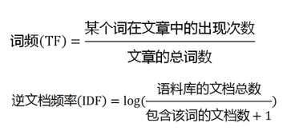

## Python Version
* version 2.7.12
## Package
* SnowNLP
~~~~
pip install snownlp
~~~~
## SnowNLP
snownlp是一個中文的自然語言處理的Python套件，支援中文自然語言操作
* 中文分詞 (Character-Based Generative Model)
*	詞性標注 ([TnT](http://aclweb.org/anthology//A/A00/A00-1031.pdf), 3-gram)
*	情感分析 (Naive Bayes)
*	文本分類 (Naive Bayes)
*	轉換成拼音 (Trie樹實現的最大匹配)
*	繁體轉簡體 (Trie樹實現的最大匹配)
*	提取文本關鍵字 ([TextRank](http://acl.ldc.upenn.edu/acl2004/emnlp/pdf/Mihalcea.pdf))
*	提取文本摘要 ([TextRank](http://acl.ldc.upenn.edu/acl2004/emnlp/pdf/Mihalcea.pdf))
*	TF-IDF
*	Tokenization
*	文本相似 ([BM25](http://en.wikipedia.org/wiki/Okapi_BM25))
### 優缺點
優點
* 購物類的評論的準確率較高 => 內建購物相關評論詞庫

缺點
* 分詞及及情感分析速度不快

### SnowNLP 情感分析
情感分析結果是【0，1】區間上的一個值，越接近1，情感越積極，越接近0，情感越消極 => 可以理解為positive的概率
~~~~
s.sentiments
~~~~

### SnowNLP 繁體轉簡體
~~~~
s.han
~~~~

### SnowNLP 提取文章關鍵字
~~~~
s.keywords(N) # 提取N個關鍵字詞
~~~~

### SnowNLP 提取文章摘要
~~~~
s.summary(N) # 提取N個關鍵字詞組成摘要
~~~~

### SnowNLP 訓練
~~~~
#分詞訓練
from snownlp import seg
seg.train('data.txt')
seg.save('seg.marshal')

#詞性標註訓練
from snownlp import tag
tag.train('.txt')
tag.save('tag.marshal')

#情感分析訓練
from snownlp import sentiment
sentiment.train('negative.txt', 'positive.txt')
sentiment.save('sentiment.marshal')
~~~~
訓練好的就存儲為seg.marshal，將snownlp/seg/__init__.py的data_path指向剛訓練好的檔

### SnowNLP TF-IDF
TF-IDF評估一個字詞對於一個檔集或一個語料庫中的其中一份檔的重要程度。TF詞頻越大代表越重要，但是文中會的“的”，“你”等無意義詞頻很大，卻信息量幾乎為0，這種情況導致單純看詞頻評價詞語重要性是不準確的。因此需搭配IDF的主要思想是：如果包含詞條t的文檔越少，也就是n越小，IDF越大，則說明詞條t越重要

